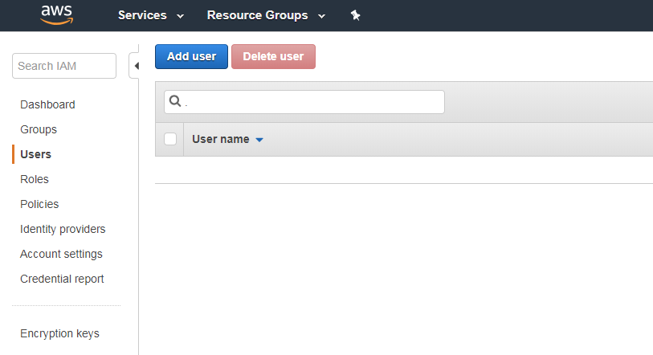
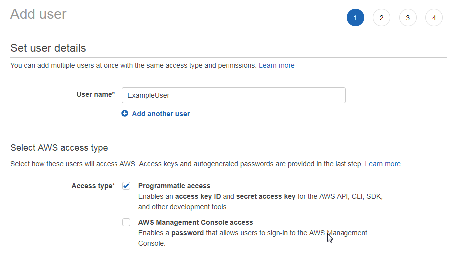
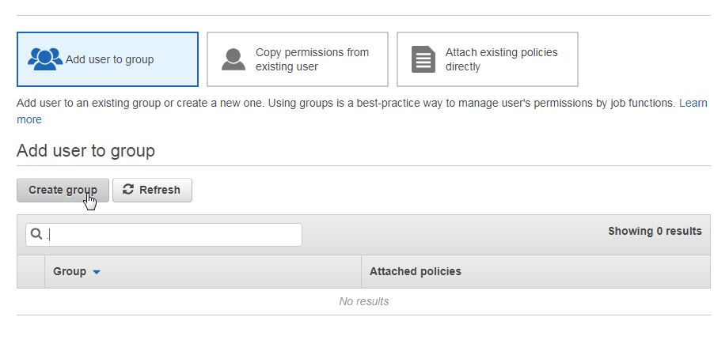
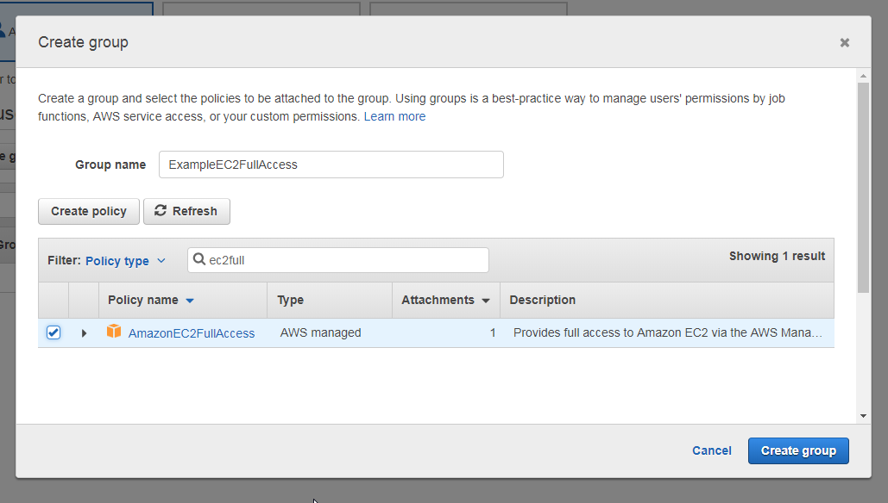
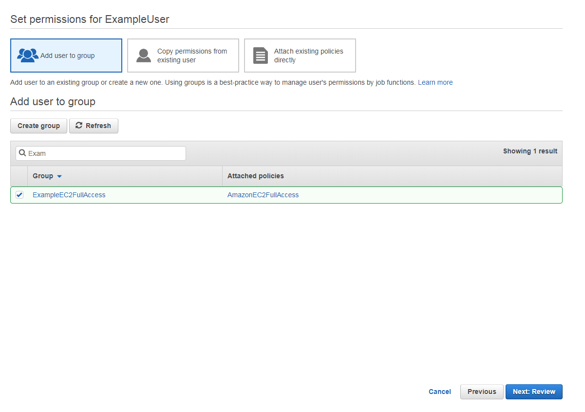
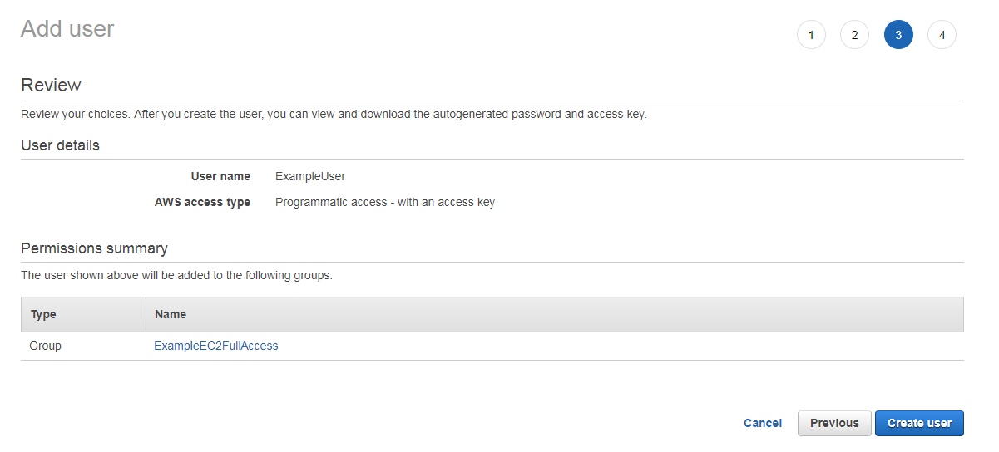
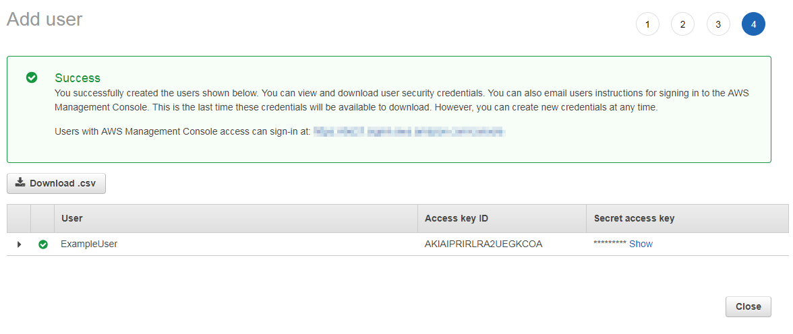

# Creating an AWS Account and Authorized User

> Optional: You only have to do this if you want to run DOCKAWEX on Amazon as well.

First of all you need an AWS account at Amazon. You simply create this account at https://aws.amazon.com . Attention you need your VISA card here, because Amazon wants money from you, if you exceed the free amount. If you have this account, we can continue. The goal is to start an EC2 instance via docker-machine and get our docker containers running there.

We need the following parameters to create an EC2 instance via Docker:

- amazonec2-access-key
- amazonec2-secret-key
- amazonec2-region
- amazonec2-vpc-id
- amazonec2-instance-type

For the first two parameters you need a corresponding user. This user can be created via the [IAM Console] (https://console.aws.amazon.com/iam/home?#users).



There you enter a username and check the box before "Programmatic access". Then you click also "next".



Now we have to assign the new user to a group. Since we start with a new account, we create a group first. For this we click on "Create group".



Then we give the group a corresponding name in the popup that appears. Furthermore, we directly assign the required permission "AmaconEC2FullAccess" to the group.



Now we are back to the initial dialog and confirm with "Next:Review".



Durch bestätigen mit "Create User" legen wir den Benutzer an.



In the next view you get a confirmation that the user was created. Here it is absolutely **important** that you show the AccessKe and the SecretAccessKey or download it as CSV.



Next we download the [AWS Command Line Interface](https://docs.aws.amazon.com/de_en/cli/latest/userguide/installing.html) short awscli and install it as described.
To configure awscli you have to enter a ```aws configure`` in the console as follows
Now you are asked for the AWS Access Key ID and the AWS Secret Access Key. Here we take the one of the newly created user. As default region name I entered "eu-central-1". This stands for Frankfurt. Others can be found [here](https://docs.aws.amazon.com/AWSEC2/latest/UserGuide/using-regions-availability-zones.html) As default output format you can choose json.

In order to determine the parameter for the default VPC, simply type

```bash
  aws ec2 describe-subnets
```

on the console. Here you get the following output:

```json
{
    "Subnets": [
        {
            "VpcId": "vpc-123ExamplpleID",
            "AvailableIpAddressCount": 4089,
            "MapPublicIpOnLaunch": true,
            "DefaultForAz": true,
            "Ipv6CidrBlockAssociationSet": [],
            "State": "available",
            "AvailabilityZone": "eu-central-1a",
            "SubnetId": "subnet-123exmpl",
            "CidrBlock": "172.31.0.0/20",
            "AssignIpv6AddressOnCreation": false
        },
        {
            "VpcId": "vpc-123ExamplpleID",
            "AvailableIpAddressCount": 4091,
            "MapPublicIpOnLaunch": true,
            "DefaultForAz": true,
            "Ipv6CidrBlockAssociationSet": [],
            "State": "available",
            "AvailabilityZone": "eu-central-1c",
            "SubnetId": "subnet-123exmpl",
            "CidrBlock": "172.31.32.0/20",
            "AssignIpv6AddressOnCreation": false
        },
        {
            "VpcId": "vpc-123ExamplpleID",
            "AvailableIpAddressCount": 4090,
            "MapPublicIpOnLaunch": true,
            "DefaultForAz": true,
            "Ipv6CidrBlockAssociationSet": [],
            "State": "available",
            "AvailabilityZone": "eu-central-1b",
            "SubnetId": "subnet-123exmpl",
            "CidrBlock": "172.31.16.0/20",
            "AssignIpv6AddressOnCreation": false
        }
    ]
}
```

As instance type I take **T2.Small**. You can read about other types [here](https://aws.amazon.com/de/ec2/instance-types/).

To create an EC2 instance with docker-machine the following command should do:

```bash
docker-machine -D create \
      --driver amazonec2 \  
      --amazonec2-access-key <AWS_ACCESS_KEY_ID> \
      --amazonec2-secret-key <AWS_SECRET_ACCESS_KEY> \
      --amazonec2-vpc-id <AWS_VPC_ID> \
      --amazonec2-region eu-central-1 \
      --amazonec2-instance-type t2.small \
      testmachine
```
